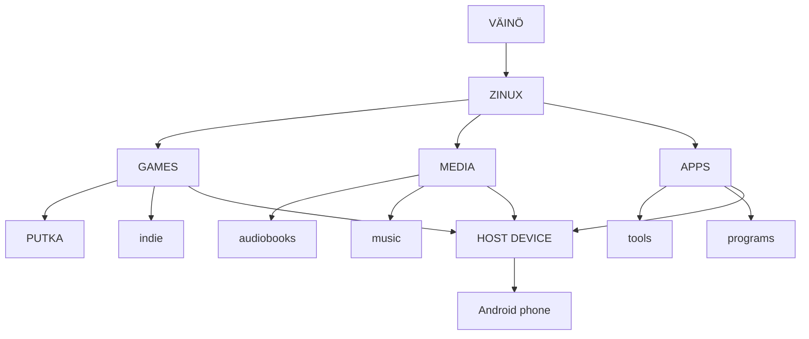

# Väinö

**One device. One computer. Your rules.**

---

## Overview

Väinö is an **open computing ecosystem** built around something almost everyone already owns: a phone. Instead of requiring new hardware, Väinö transforms an existing Android phone into a **portable computer, game console, media device, and personal computing platform**.

The first version of Väinö is an **Android application** containing a virtualized **Zinux computer**. The long-term goal is to allow the same Zinux environment to eventually run directly on dedicated hardware.

---

## The Problem

Modern consumer devices increasingly hide the computer from their owner:

- Televisions become advertising and tracking platforms.
- Phones become locked ecosystems.
- Games become services.
- Digital media becomes something you access rather than something you own.
- Old devices become obsolete even when their hardware is still capable.

**Väinö takes the opposite approach:** The computer should remain **visible, understandable, and useful** to its owner.

---

## The Idea

Väinö separates the computing environment from the physical device. A phone is the first hardware platform, but it is not the definition of Väinö. A phone can become:

- A game console
- A computer
- A media player
- An audiobook device
- A music player
- A television interface
- A development machine
- A server
- Or simply remain a phone

The same device can serve different purposes depending on what is connected to it.



---

## Zinux

Zinux is the **operating system at the heart of Väinö**. It is designed around:

- A small trusted core
- Isolated components
- Capabilities
- Explicit control over hardware and resources

**Zinux does not attempt to reproduce every feature of a traditional desktop operating system.** Its purpose is to provide a **small, understandable, and controllable computing environment**.

### Long-Term Zinux Architecture

The long-term architecture is intended to support:

- Isolated applications
- Capability-based resource access
- Sandboxed drivers
- Modular services
- Local-first operation
- Deterministic system components
- Hardware abstraction
- Eventual direct hardware execution

> **Note:** AI-assisted driver synthesis remains an important research direction, but it is not the reason Väinö exists. **The user comes first.**

---

## The First Väinö

The first Väinö **does not replace Android**. It runs **inside Android**.

```
┌───────────────────────────────┐
│            Android            │
│                               │
│    ┌─────────────────────┐    │
│    │      Väinö APK      │    │
│    │                     │    │
│    │       Zinux         │    │
│    │                     │    │
│    │ virtual hardware    │    │
│    │ games / media / apps│    │
│    └─────────────────────┘    │
│                               │
│        Android hardware       │
└───────────────────────────────┘
```

This is **deliberate**. Väinö should not require years of hardware-specific driver development before anyone can use it. The **Android host provides access to the existing device hardware**, while Zinux sees a **stable virtual hardware interface**. This allows Väinö to target many Android devices from the beginning.

---

## Hardware Independence

The **initial goal** is not to boot Zinux directly on one specific phone. Instead, it is to **run Zinux on any capable Android device through Väinö**. This changes the development problem completely.

Instead of immediately supporting:

- Hundreds of phone SoCs
- Different GPUs
- Different displays
- Different modems
- Different sensors
- Different bootloaders

Väinö initially needs to support **one virtual hardware platform**. Android handles the physical hardware, and later, direct Zinux ports can remove that abstraction when it makes sense.

---

## One Device, Many Environments

A Väinö phone should become **more useful when connected to other hardware**.

### Television
```
Phone
  │
USB-C / wireless display
  ↓
TV
  ↓
Väinö Game / Media interface
```
The phone becomes a **television computer and game console**.

### Computer Monitor
```
Phone
  │
USB-C
  ├── Display
  ├── Keyboard
  └── Mouse
        ↓
      Väinö
```
The phone becomes a **desktop computer**.

### Portable Use
```
Phone
  ↓
Headphones
  ↓
Music / Audiobooks
```
No additional device is required.

### Controller
```
Phone
  +
Bluetooth controller
  ↓
Väinö
  ↓
Game console
```
The hardware already exists. Väinö changes how it is used.

---

## The Command Line

Väinö should **intentionally retain a command-line-first identity**. The initial environment should feel closer to a **1990s computer** than a modern smart-TV interface.

**Example:**
```bash
Väinö
> help
> games
> files
> media
> network
> settings
$
```

A graphical interface may exist where it provides real value, but it should **not hide the underlying computer**. The user should be able to see that:

- Games are programs
- Programs are files
- Files exist on storage
- Processes are running
- Networks are connected
- Hardware exists underneath the software

A child should be able to use Väinö as a **game console**, and a curious child should also be able to discover that it is a **computer**.

---

## Games

Games are one of the first major uses of Väinö. **PUTKA** is intended to be an early reference game for the platform. Väinö is **not intended to become another Steam**. The goal is a **simple platform** where games can be distributed, installed, and played without making the platform itself the center of the experience.

Open-source games are particularly interesting for Väinö because the platform can expose the relationship between a game and its source code. A game can be something the user **plays**, but it can also be something the user **studies, modifies, and rebuilds**.

---

## Media

Väinö should treat media as **files and services** rather than as an invisible cloud dependency. Potential uses include:

- Audiobooks
- Music
- Video
- Podcasts
- Local media libraries

The platform should support **both online services and local/offline content**. A user should be able to continue using their device when the network disappears.

---

## Apps

Väinö should support **useful applications** without trying to reproduce every application ecosystem. The goal is a **small, understandable environment**. Applications should have **explicit access to resources**.

- A calculator should not need access to a microphone.
- An audiobook player should not need unrestricted access to the system.
- A game should not automatically own the entire computer.

This follows the **Zinux capability model**.

---

## Ownership

Väinö is built around the idea that a computing device should remain **useful to its owner**. The owner should be able to:

- Install software
- Remove software
- Keep local files
- Use the device offline
- Connect peripherals
- Replace the software environment
- Inspect the system
- Modify software where licenses allow it

Väinö should **not require a centralized account** merely to use the computer. The ecosystem may provide services, stores, and distribution mechanisms, but those services should **not become the definition of the device**.

---

## Distribution

The Väinö ecosystem may eventually provide a **simple software catalog**. The catalog is **not intended to become a second Steam**.

A possible model:
```
Developer
    │
    ├── source repository
    │
    ↓
Väinö build system
    │
    ├── build
    ├── validate
    └── sign
    │
    ↓
Väinö package
    │
    ↓
User
    │
    ↓
Zinux
```

The underlying source repository can remain **visible to developers**, while installation remains **simple for users**.

---

## Privacy

Väinö should be **local-first**. The system should not require cloud services for basic computing. Network access should be **explicit**. Services should not automatically become surveillance mechanisms. The user should be able to **understand what the device is doing**.

---

## Hardware Lifecycle

Väinö is deliberately interested in **hardware that already exists**. A phone that has become too old to be someone’s primary phone may still have:

- A capable CPU
- GPU
- Display
- Storage
- Wi-Fi
- Bluetooth
- Battery
- Speakers
- Cameras
- USB

Instead of becoming **electronic waste**, it can become a **Väinö computer**. The first target is therefore **not new hardware**, but **hardware already sitting in drawers**.

---

## Long-Term Hardware

The Android application is the **first step**, not necessarily the final form. The same Zinux environment may eventually run directly on:

- Phones
- Handheld computers
- Game consoles
- TV boxes
- Laptops
- Servers
- Robots
- Dedicated Väinö hardware

The software architecture should make this transition possible **without making it a requirement for the first release**.

---

## Design Principles

1. **The computer should remain visible.**
   Do not hide everything behind an appliance interface.

2. **The owner should control the device.**
   The device should remain useful without a central service.

3. **Reuse hardware before creating new hardware.**
   A discarded phone is already a computer.

4. **Small is a feature.**
   Every component has a cost in complexity, maintenance, and trust.

5. **Local first.**
   Offline operation should be normal, not an emergency mode.

6. **Open where it matters.**
   Users and developers should be able to understand and modify the system where the relevant licenses permit it.

7. **Games are applications, not the operating system.**
   PUTKA can be an important game for Väinö without defining the entire platform.

8. **Hardware should not determine the ecosystem.**
   The first Väinö should run through Android so that the ecosystem does not have to wait for years of hardware support.

---

## The Vision

Väinö is **not another smart TV**. It is not another game store. It is not another phone. It is not another Linux distribution. It is a way of turning the computer people already carry into a computer they **actually control**.

**One device. Many uses.**

Your games. Your media. Your programs. Your files.

**Your rules.**
