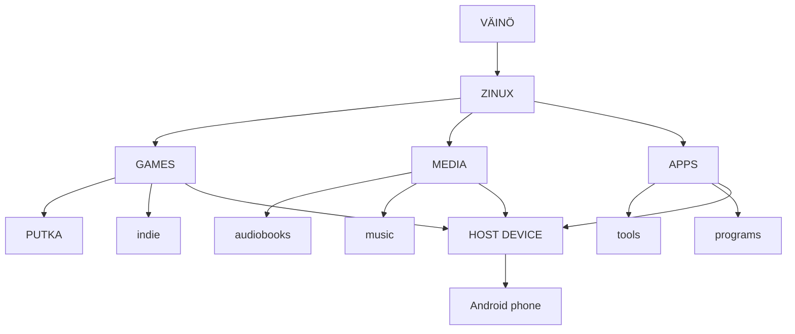

# Väinö

**One device. One computer. Your rules.**

---

## Overview

Väinö is an **open computing ecosystem** built around something almost everyone already owns: a phone. Instead of requiring new hardware, Väinö transforms an existing Android phone into a **portable computer, game console, media device, and personal computing platform**.

The first version of Väinö is an **Android application** containing a virtualized **Zinux computer**. The long-term goal is to allow the same Zinux environment to eventually run directly on dedicated hardware.

---

## The Problem

Modern consumer devices increasingly hide the computer from their owner:

- Televisions become advertising and tracking platforms.
- Phones become locked ecosystems.
- Games become services.
- Digital media becomes something you access rather than something you own.
- Old devices become obsolete even when their hardware is still capable.

**Väinö takes the opposite approach:** The computer should remain **visible, understandable, and useful** to its owner.

---

## The Idea

Väinö separates the computing environment from the physical device. A phone is the first hardware platform, but it is not the definition of Väinö. A phone can become:

- A game console
- A computer
- A media player
- An audiobook device
- A music player
- A television interface
- A development machine
- A server
- Or simply remain a phone

The same device can serve different purposes depending on what is connected to it.



---

## Zinux

Zinux is the **operating system at the heart of Väinö**. It is designed around:

- A small trusted core
- Isolated components
- Capabilities
- Explicit control over hardware and resources

**Zinux does not attempt to reproduce every feature of a traditional desktop operating system.** Its purpose is to provide a **small, understandable, and controllable computing environment**.

### Long-Term Zinux Architecture

The long-term architecture is intended to support:

- Isolated applications
- Capability-based resource access
- Sandboxed drivers
- Modular services
- Local-first operation
- Deterministic system components
- Hardware abstraction
- Eventual direct hardware execution

> **Note:** AI-assisted driver synthesis remains an important research direction, but it is not the reason Väinö exists. **The user comes first.**

---

## The First Väinö

The first Väinö **does not replace Android**. It runs **inside Android**.

```
┌───────────────────────────────┐
│            Android            │
│                               │
│    ┌─────────────────────┐    │
│    │      Väinö APK      │    │
│    │                     │    │
│    │       Zinux         │    │
│    │                     │    │
│    │ virtual hardware    │    │
│    │ games / media / apps│    │
│    └─────────────────────┘    │
│                               │
│        Android hardware       │
└───────────────────────────────┘
```

This is **deliberate**. Väinö should not require years of hardware-specific driver development before anyone can use it. The **Android host provides access to the existing device hardware**, while Zinux sees a **stable virtual hardware interface**. This allows Väinö to target many Android devices from the beginning.

---

## Hardware Independence

The **initial goal** is not to boot Zinux directly on one specific phone. Instead, it is to **run Zinux on any capable Android device through Väinö**. This changes the development problem completely.

Instead of immediately supporting:

- Hundreds of phone SoCs
- Different GPUs
- Different displays
- Different modems
- Different sensors
- Different bootloaders

Väinö initially needs to support **one virtual hardware platform**. Android handles the physical hardware, and later, direct Zinux ports can remove that abstraction when it makes sense.

---

## One Device, Many Environments

A Väinö phone should become **more useful when connected to other hardware**.

### Television
```
Phone
  │
USB-C / wireless display
  ↓
TV
  ↓
Väinö Game / Media interface
```
The phone becomes a **television computer and game console**.

### Computer Monitor
```
Phone
  │
USB-C
  ├── Display
  ├── Keyboard
  └── Mouse
        ↓
      Väinö
```
The phone becomes a **desktop computer**.

### Portable Use
```
Phone
  ↓
Headphones
  ↓
Music / Audiobooks
```
No additional device is required.

### Controller
```
Phone
  +
Bluetooth controller
  ↓
Väinö
  ↓
Game console
```
The hardware already exists. Väinö changes how it is used.

---

## The Command Line

Väinö should **intentionally retain a command-line-first identity**. The initial environment should feel closer to a **1990s computer** than a modern smart-TV interface.

**Example:**
```bash
Väinö
> help
> games
> files
> media
> network
> settings
$
```

A graphical interface may exist where it provides real value, but it should **not hide the underlying computer**. The user should be able to see that:

- Games are programs
- Programs are files
- Files exist on storage
- Processes are running
- Networks are connected
- Hardware exists underneath the software

A child should be able to use Väinö as a **game console**, and a curious child should also be able to discover that it is a **computer**.

---

## Games

Games are one of the first major uses of Väinö. **PUTKA** is intended to be an early reference game for the platform. Väinö is **not intended to become another Steam**. The goal is a **simple platform** where games can be distributed, installed, and played without making the platform itself the center of the experience.

Open-source games are particularly interesting for Väinö because the platform can expose the relationship between a game and its source code. A game can be something the user **plays**, but it can also be something the user **studies, modifies, and rebuilds**.

---

## Media

Väinö should treat media as **files and services** rather than as an invisible cloud dependency. Potential uses include:

- Audiobooks
- Music
- Video
- Podcasts
- Local media libraries

The platform should support **both online services and local/offline content**. A user should be able to continue using their device when the network disappears.

---

## Apps

Väinö should support **useful applications** without trying to reproduce every application ecosystem. The goal is a **small, understandable environment**. Applications should have **explicit access to resources**.

- A calculator should not need access to a microphone.
- An audiobook player should not need unrestricted access to the system.
- A game should not automatically own the entire computer.

This follows the **Zinux capability model**.

---

## Ownership

Väinö is built around the idea that a computing device should remain **useful to its owner**. The owner should be able to:

- Install software
- Remove software
- Keep local files
- Use the device offline
- Connect peripherals
- Replace the software environment
- Inspect the system
- Modify software where licenses allow it

Väinö should **not require a centralized account** merely to use the computer. The ecosystem may provide services, stores, and distribution mechanisms, but those services should **not become the definition of the device**.

---

## Distribution

The Väinö ecosystem may eventually provide a **simple software catalog**. The catalog is **not intended to become a second Steam**.

A possible model:
```
Developer
    │
    ├── source repository
    │
    ↓
Väinö build system
    │
    ├── build
    ├── validate
    └── sign
    │
    ↓
Väinö package
    │
    ↓
User
    │
    ↓
Zinux
```

The underlying source repository can remain **visible to developers**, while installation remains **simple for users**.

---

## Privacy

Väinö should be **local-first**. The system should not require cloud services for basic computing. Network access should be **explicit**. Services should not automatically become surveillance mechanisms. The user should be able to **understand what the device is doing**.

---

## Hardware Lifecycle

Väinö is deliberately interested in **hardware that already exists**. A phone that has become too old to be someone’s primary phone may still have:

- A capable CPU
- GPU
- Display
- Storage
- Wi-Fi
- Bluetooth
- Battery
- Speakers
- Cameras
- USB

Instead of becoming **electronic waste**, it can become a **Väinö computer**. The first target is therefore **not new hardware**, but **hardware already sitting in drawers**.

---

## Long-Term Hardware

The Android application is the **first step**, not necessarily the final form. The same Zinux environment may eventually run directly on:

- Phones
- Handheld computers
- Game consoles
- TV boxes
- Laptops
- Servers
- Robots
- Dedicated Väinö hardware

The software architecture should make this transition possible **without making it a requirement for the first release**.

---

## Design Principles

1. **The computer should remain visible.**
   Do not hide everything behind an appliance interface.

2. **The owner should control the device.**
   The device should remain useful without a central service.

3. **Reuse hardware before creating new hardware.**
   A discarded phone is already a computer.

4. **Small is a feature.**
   Every component has a cost in complexity, maintenance, and trust.

5. **Local first.**
   Offline operation should be normal, not an emergency mode.

6. **Open where it matters.**
   Users and developers should be able to understand and modify the system where the relevant licenses permit it.

7. **Games are applications, not the operating system.**
   PUTKA can be an important game for Väinö without defining the entire platform.

8. **Hardware should not determine the ecosystem.**
   The first Väinö should run through Android so that the ecosystem does not have to wait for years of hardware support.

---

## The Vision

Väinö is **not another smart TV**. It is not another game store. It is not another phone. It is not another Linux distribution. It is a way of turning the computer people already carry into a computer they **actually control**.

**One device. Many uses.**

Your games. Your media. Your programs. Your files.

**Your rules.**


# Väinö — Technical Architecture

---

## 1. Goal

The first technical goal of Väinö is:

**Run a usable Zinux computer inside an Android application on existing phones.**

- The **Android application** is the host.
- **Zinux** is the guest operating system.
- The **physical phone hardware** is accessed through the Android host rather than through phone-specific Zinux drivers.

This allows Väinö to support many Android devices without first implementing a native driver stack for every SoC and phone model.

---

## 2. High-Level Architecture

```
┌─────────────────────────────────────────────────────────┐
│                       PHONE                             │
│                                                         │
│  ┌───────────────────────────────────────────────────┐  │
│  │                    ANDROID                        │  │
│  │                                                   │  │
│  │  ┌─────────────────────────────────────────────┐  │  │
│  │  │                  VÄINÖ APK                  │  │  │
│  │  │                                             │  │  │
│  │  │  ┌───────────────────────────────────────┐  │  │  │
│  │  │  │                 ZINUX                 │  │  │  │
│  │  │  │                                       │  │  │  │
│  │  │  │  Kernel                               │  │  │  │
│  │  │  │  Userland                             │  │  │  │
│  │  │  │  Services                             │  │  │  │
│  │  │  │  Games / Apps                         │  │  │  │
│  │  │  └───────────────────────────────────────┘  │  │  │
│  │  │                     │                       │  │  │
│  │  │              Virtual Hardware              │  │  │
│  │  │                     │                       │  │  │
│  │  │  ┌──────────────────┼────────────────────┐  │  │  │
│  │  │  │ CPU │ Memory │ Display │ Audio │ I/O │  │  │  │
│  │  │  └──────────────────┼────────────────────┘  │  │  │
│  │  │                     │                       │  │  │
│  │  └─────────────────────┼───────────────────────┘  │  │
│  │                        │                          │  │
│  │                Android APIs / NDK                │  │
│  └────────────────────────┼─────────────────────────┘  │
│                           │                            │
│                      PHONE HARDWARE                    │
└─────────────────────────────────────────────────────────┘
```

The architecture deliberately separates:

1. Physical hardware
2. Android host
3. Väinö application
4. Virtual hardware
5. Zinux
6. Zinux applications

---

## 3. Why Virtualization Comes First

Directly supporting modern Android phones would require device-specific work for:

- SoC initialization
- Bootloaders
- Memory controllers
- Interrupt controllers
- Display controllers
- GPUs
- Storage controllers
- Audio hardware
- Touchscreen controllers
- Wi-Fi
- Bluetooth
- Modem
- Cameras
- Sensors
- Power management

**This is not the first problem Väinö needs to solve.**

Instead:

```
Android hardware
       ↓
Android APIs
       ↓
Väinö host
       ↓
Virtual hardware
       ↓
Zinux
```

The same Zinux image can therefore run on **different Android devices**.

---

## 4. Execution Model

The first implementation should prefer **hardware-assisted virtualization** where available. The target architecture is **ARM64**.

Conceptually:

```
Android process
       │
       ├── virtualization layer
       │
       └── Zinux ARM64 guest
```

The exact implementation may use an appropriate **Android-compatible virtualization mechanism** rather than implementing a CPU emulator from scratch.

- **CPU emulation** should only be introduced when necessary.
- The initial target is: **native ARM64 guest execution with virtualized devices**.

---

## 5. Virtual Hardware

Zinux should see a **deliberately small virtual machine**. The first virtual hardware platform should contain only what is required to **boot and run useful software**.

### Initial Devices:

- Virtual CPU
- Virtual RAM
- Virtual timer
- Virtual interrupt controller
- Virtual block device
- Virtual framebuffer / display
- Virtual input device
- Virtual serial console
- Virtual network device
- Virtual audio device

Additional devices can be added later. The **virtual hardware specification** should be **stable and documented**. This becomes the **hardware contract** between Väinö and Zinux.

---

## 6. Boot Process

The first boot target:

```
Android
   ↓
Väinö APK
   ↓
Create virtual machine
   ↓
Allocate guest memory
   ↓
Load Zinux kernel
   ↓
Create virtual devices
   ↓
Start Zinux
   ↓
Zinux initializes
   ↓
Zinux userland
   ↓
Väinö shell
```

The first successful milestone is:

```
Väinö
Zinux boot OK
>
```

**No graphical desktop is required.**

---

## 7. Zinux Kernel

The existing Zinux kernel architecture remains the foundation. The kernel should remain **small** and should provide:

- Memory management
- Scheduling
- Interrupts
- IPC
- Capabilities
- Process isolation
- Basic filesystem access
- Device abstraction

The kernel should **not** contain application logic. The Android host should also **not** become part of the Zinux kernel.

---

## 8. Capability Model

Zinux applications and services should receive **explicit capabilities**.

### Example:

```
GAME
 ├── CAP_DISPLAY
 ├── CAP_AUDIO
 ├── CAP_INPUT
 └── CAP_FILES(game-data)

AUDIO PLAYER
 ├── CAP_AUDIO
 ├── CAP_FILES(audio-library)
 └── CAP_NETWORK(optional)

TERMINAL
 ├── CAP_FILES(user-space)
 └── CAP_NETWORK(optional)
```

Applications should **not** receive unrestricted system access by default. The **capability system** is a core part of the **security model**.

---

## 9. Android Host Responsibilities

The Android application is a **compatibility layer**, not the operating system. The host should provide **controlled access** to:

### Display
```
Zinux framebuffer / graphics output
        ↓
Android Surface / graphics API
        ↓
phone display
```

### Input
```
Touchscreen
Buttons
Keyboard
Controller
        ↓
Android input APIs
        ↓
Virtual Zinux input device
```

### Audio
```
Zinux audio
      ↓
Väinö audio bridge
      ↓
Android audio API
      ↓
Speaker / headphones / Bluetooth
```

### Storage
```
Zinux filesystem
      ↓
Väinö storage layer
      ↓
Android app storage
```

### Networking
```
Zinux network device
      ↓
Väinö network bridge
      ↓
Android networking
      ↓
Wi-Fi / mobile network
```

The host should expose **only the functionality required by the guest**.

---

## 10. Storage

The initial Zinux filesystem should live inside the **Android application’s storage**.

Conceptually:

```
Android storage
└── Vaino/
    ├── system/
    ├── games/
    ├── apps/
    ├── media/
    ├── saves/
    └── user/
```

Zinux sees a **normal filesystem**. The Android host sees **application-managed data**.

Later versions may support:

- External storage
- USB drives
- SD cards
- Shared media directories
- Dedicated Väinö storage

---

## 11. Graphics

Graphics should initially prioritize **simplicity**.

### Phase 1:
```
Zinux
  ↓
virtual framebuffer
  ↓
Android Surface
  ↓
display
```

### Phase 2:
May introduce **accelerated graphics**:

```
Zinux game
  ↓
virtual GPU
  ↓
Väinö graphics bridge
  ↓
Android GPU API
  ↓
physical GPU
```

The **virtual GPU interface** should remain **independent of the physical GPU**.

---

## 12. Audio

Audio should initially use a **simple PCM interface**.

```
Zinux
  ↓
virtual audio device
  ↓
Väinö audio bridge
  ↓
Android Audio API
```

Later support may include:

- Low-latency audio
- Bluetooth audio
- Microphone input
- Multiple audio devices
- Spatial audio

---

## 13. Networking

The first network implementation should expose a **standard virtual network device**.

```
Zinux
  ↓
virtual NIC
  ↓
Väinö network bridge
  ↓
Android
  ↓
Wi-Fi / mobile data
```

Zinux should **not** need to know whether the physical connection is Wi-Fi, 5G, Ethernet, or another Android-supported network.

---

## 14. USB and External Displays

USB-C is important because it allows the phone to become a **different kind of computer**.

Potential topology:

```
                  USB-C
                    │
          ┌─────────┼─────────┐
          ↓         ↓         ↓
       Display   Keyboard    USB
          │         │         │
          └─────────┼─────────┘
                    ↓
                  VÄINÖ
                    ↓
                  ZINUX
```

The initial Android implementation can rely on **Android support for USB and external displays**. Direct Zinux hardware support can come later.

---

## 15. User Interface

The Zinux interface should remain **command-line-first**.

Example:
```bash
Väinö
> help
> games
> media
> files
> apps
> network
> settings
$
```

A **graphical shell** can exist above this environment, but it should **not replace** the underlying command-line model. The goal is that the user can **always discover the computer underneath the interface**.

---

## 16. Applications

Applications should run **inside Zinux** rather than being Android applications.

### Initial Categories:

- Games
- Media
- Audio
- Tools
- Development
- Education

Each application should **declare required capabilities**.

### Example:
```toml
name = "putka"
version = "0.1.0"
[capabilities]
display = true
audio = true
input = true
filesystem = "games/putka"
network = false
```

The capability format is **illustrative** and may change.

---

## 17. Game Runtime

Games should have a **stable Zinux-facing API**.

### Initial API Categories:

- Graphics
- Audio
- Input
- Filesystem
- Timing
- Network

A game should **not** depend directly on the Android host.

```
PUTKA
  ↓
Zinux Game API
  ↓
Zinux
  ↓
Väinö virtual hardware
  ↓
Android
```

This allows the same game to eventually run on **native Zinux hardware**.

---

## 18. Software Distribution

Väinö should eventually provide a **package format** for applications and games.

### Example:
```
putka-1.0.vpkg
```

A package should contain:

- Manifest
- Executable
- Assets
- Metadata
- Signature

The package manager should **verify signatures before installation**.

Example:
```bash
> install putka
Downloading...
Verifying signature...
Installing...
PUTKA installed.
```

The distribution system should **not** require a centralized store for the operating system to function.

Packages may eventually be distributed through:

- Väinö Store
- Developer websites
- Git repositories
- Local network
- USB
- SD cards
- Direct file transfer

---

## 19. Build System

**Zig** is the preferred build and systems-development environment for the platform.

A project may contain:
```
project/
├── build.zig
├── src/
├── assets/
├── vaino.toml
└── README.md
```

A conceptual build command:
```bash
vaino build
```

The result is a **reproducible Väinö package**. The exact package/build tooling is **intentionally not fixed yet**.

---

## 20. Development Environment

The host development loop should be **fast**.

Preferred workflow:
```
Developer
   ↓
source code
   ↓
Zig build
   ↓
Zinux image
   ↓
Väinö emulator / VM
   ↓
test
```

A **desktop development environment** should be able to run the same Zinux virtual machine used by the Android application. This avoids requiring a **physical phone for every kernel change**.

---

## 21. Reference Development Platforms

The first physical Android test device is:

**Motorola Edge 40 Neo 5G**

Device-specific hardware support is **not** a prerequisite for the first Väinö release. The phone is initially treated as an **Android host**. Its physical hardware is therefore mostly **irrelevant to Zinux**.

This is **intentional**. Later, the device may become a candidate for **native Zinux support**.

---

## 22. Native Hardware Mode

The long-term architecture should allow:

```
              VÄINÖ
                │
        ┌───────┴────────┐
        │                │
 Android host       Native hardware
        │                │
        └───────┬────────┘
                │
              ZINUX
```

The same Zinux userland and application model should work in **both environments** where practical. Native hardware support should be developed **only after the virtual platform is stable**.

---

## 23. Driver Architecture

There are **two different driver problems**.

### Virtual Platform

Zinux drivers talk to **standardized virtual devices**. These should be **relatively small and stable**.

### Native Hardware

Zinux drivers talk **directly to physical hardware**. These are **device-specific**.

The native driver architecture may eventually use the **original Zinux concept**:

```
Hardware
    ↓
Hardware description
    ↓
Driver requirements
    ↓
AI-assisted driver generation
    ↓
Validation
    ↓
Sandbox
    ↓
Capability boundary
    ↓
Driver
```

**AI-generated drivers must never automatically receive unrestricted kernel authority.**

---

## 24. Security Model

The Android application is an **important security boundary**. Zinux is initially a **guest environment inside Android**.

Inside Zinux, additional boundaries exist:

```
Android sandbox
       ↓
Zinux VM
       ↓
Zinux kernel
       ↓
services
       ↓
applications
```

Each layer should expose **only the resources required by the next layer**.

- A compromised game should **not** automatically compromise the Zinux kernel.
- A compromised Zinux guest should **not** automatically compromise Android.

The implementation must treat **virtualization and Android security boundaries as security-critical components**.

---

## 25. Offline Operation

The core system should operate **without an internet connection**.

The following should work offline:

- Boot
- Terminal
- Installed games
- Installed applications
- Local files
- Local media
- Configuration

**Network-dependent services should be optional.**

---

## 26. Development Phases

### Phase 0 — Architecture

- Define virtual hardware
- Define guest/host boundary
- Define boot protocol
- Define storage model
- Define capability model

### Phase 1 — Zinux VM

- ARM64 guest execution
- Virtual RAM
- Timer
- Interrupts
- Serial console
- Block storage
- Successful kernel boot

**Milestone:**
```
Zinux boot OK
>
```

### Phase 2 — Android Host

- Android application
- VM lifecycle
- Display output
- Input
- Storage
- Audio
- Networking

**Milestone:**
```
Zinux running inside Väinö APK
```

### Phase 3 — Usable Computer

- Shell
- Filesystem
- Processes
- Basic applications
- Package installation
- Persistent storage

**Milestone:**
```
A usable Zinux computer running on an ordinary Android phone.
```

### Phase 4 — Games

- Game API
- Controller input
- Graphics
- Audio
- Package format
- PUTKA prototype

**Milestone:**
```bash
> run putka
```

### Phase 5 — Media

- Audio player
- Audiobook support
- Local media
- External audio devices

### Phase 6 — Desktop Mode

- External display
- Keyboard
- Mouse
- Windowing / desktop environment (if required)

**Milestone:**
```
Phone + monitor + keyboard
        =
Väinö computer
```

### Phase 7 — Ecosystem

- Package repository
- Developer publishing
- Signing
- Optional store
- Updates
- Account-free installation flows

### Phase 8 — Native Zinux Hardware

Only after the virtual platform is stable:

- Bootloader research
- Device tree
- Physical memory
- Display
- Input
- Storage
- USB
- GPU
- Audio
- Networking
- Power management

---

## 27. What Väinö Is Not

Väinö is **not** initially:

- An Android replacement
- A new smartphone
- A Steam competitor
- A smart-TV platform
- A desktop Linux distribution
- A universal hardware compatibility project
- A cloud service
- An AI operating system

Those may become relevant **later**. The first objective is much smaller:

**Put a real Zinux computer inside a phone that already exists.**

---

## 28. First Technical Milestone

The project should consider the following the **first major success condition**:

```
Android phone
      ↓
Väinö APK
      ↓
Zinux ARM64 VM
      ↓
persistent filesystem
      ↓
terminal
      ↓
install application
      ↓
run application
```

The first application does **not** need to be a game. It can simply be:

```
hello-zinux
```

The important part is proving the **complete path**:

```
Android
   ↓
Väinö
   ↓
Zinux
   ↓
application
```

Once this works, Väinö has stopped being **only an operating-system research project**. It has become a **usable computing platform**.

